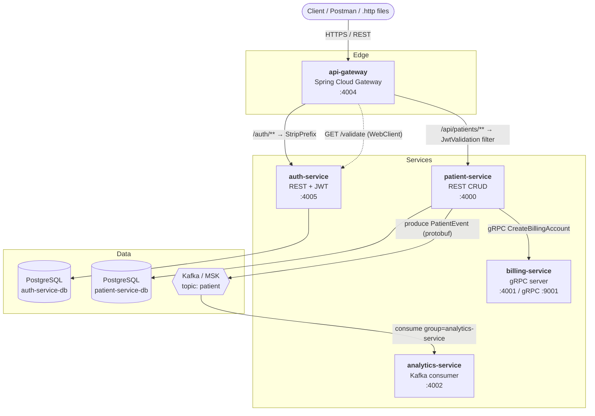
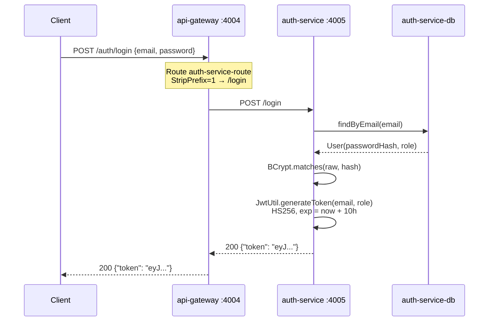
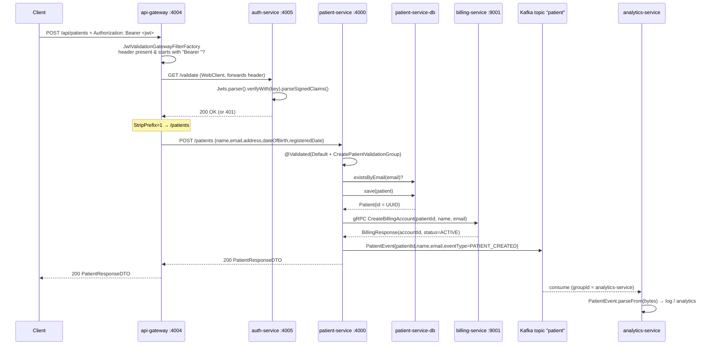

# Patient Management — Spring Boot Microservices

A production-shaped microservices system for managing patients, built with **Java 21 + Spring Boot 3.4**.
It demonstrates the full polyglot-communication picture in one codebase: **REST** at the edge,
**gRPC** for synchronous service-to-service calls, **Kafka + Protobuf** for asynchronous event
streaming, **JWT** auth enforced at an API gateway, and **AWS CDK** infrastructure-as-code that
deploys the whole thing to **LocalStack** (ECS Fargate, RDS, MSK, ALB).

---

## Table of Contents

- [Architecture](#architecture)
- [Services at a Glance](#services-at-a-glance)
- [Tech Stack](#tech-stack)
- [How Requests Flow](#how-requests-flow)
- [Repository Layout](#repository-layout)
- [Service Deep Dive](#service-deep-dive)
- [API Reference](#api-reference)
- [Configuration Reference](#configuration-reference)
- [Running the Project](#running-the-project)
  - [Prerequisites](#prerequisites)
  - [Option 1 — Run locally with embedded H2](#option-1--run-locally-with-embedded-h2-fastest)
  - [Option 2 — Run everything in Docker](#option-2--run-everything-in-docker-full-stack)
  - [Option 3 — Deploy to LocalStack with AWS CDK](#option-3--deploy-to-localstack-with-aws-cdk)
- [Seed Data & Test Credentials](#seed-data--test-credentials)
- [Testing](#testing)
- [Troubleshooting](#troubleshooting)
- [Known Gaps & Improvement Ideas](#known-gaps--improvement-ideas)

---

## Architecture

The system is composed of five independently deployable Spring Boot applications. Everything
external enters through the API Gateway; internal traffic uses gRPC and Kafka.



**Design principles applied**

| Principle | How it shows up here |
| --- | --- |
| Single entry point | `api-gateway` is the only publicly exposed service (behind an ALB in the CDK stack) |
| Centralised authN | The gateway's `JwtValidation` filter delegates token checks to `auth-service` before proxying |
| Database per service | `auth-service` and `patient-service` each own a private PostgreSQL instance — no shared schema |
| Sync where you need an answer | Billing account creation is a blocking gRPC call — the patient write depends on it |
| Async where you don't | Analytics is fire-and-forget over Kafka, so it can be down without breaking patient creation |
| Contract-first | `.proto` files define both the gRPC service and the Kafka message payload |
| Infrastructure as code | The entire cloud topology lives in one CDK Java class, deployable to LocalStack |

---

## Services at a Glance

| Service | HTTP Port | gRPC Port | Database | Messaging | Responsibility |
| --- | --- | --- | --- | --- | --- |
| **api-gateway** | `4004` | — | — | — | Routing, path rewriting, JWT enforcement |
| **auth-service** | `4005` | — | PostgreSQL | — | Login, JWT issuance (HS256), token validation |
| **patient-service** | `4000` | client → `9001` | PostgreSQL | Kafka **producer** | Patient CRUD, triggers billing + events |
| **billing-service** | `4001` | server `9001` | — | — | Creates billing accounts over gRPC |
| **analytics-service** | `4002`\* | — | — | Kafka **consumer** | Consumes `PatientEvent` for analytics |

\* `analytics-service` does not set `server.port`, so it listens on Spring Boot's default **8080**
unless you pass `SERVER_PORT=4002`. The CDK stack maps container port `4002` — see
[Known Gaps](#known-gaps--improvement-ideas).

Supporting modules (not runtime services):

| Module | Purpose |
| --- | --- |
| **infrastructure** | AWS CDK app (`LocalStack.java`) that synthesises the whole cloud stack |
| **integration-tests** | Black-box REST Assured tests that run against a live gateway on `:4004` |
| **api-requests** / **grpc-requests** | IntelliJ HTTP Client `.http` scratch files for manual testing |

---

## Tech Stack

### Core

| Area | Technology | Version |
| --- | --- | --- |
| Language | Java | **21** |
| Framework | Spring Boot | **3.4.0** (patient-service) / **3.4.1** (all others) |
| Gateway | Spring Cloud Gateway | Spring Cloud **2024.0.0** |
| Build | Maven (wrapper `mvnw`) | Maven **3.9.9** |

### Per-concern

| Concern | Technology |
| --- | --- |
| **Web / REST** | `spring-boot-starter-web` (MVC); the gateway runs reactive WebFlux / Reactor Netty |
| **Persistence** | Spring Data JPA, Hibernate, **PostgreSQL 17** (Docker/cloud), **H2** in-memory (local dev) |
| **Validation** | Jakarta Bean Validation, custom validation groups (`CreatePatientValidationGroup`) |
| **Security** | Spring Security, **BCrypt** password hashing, **JJWT 0.12.6** (HS256, 10-hour expiry) |
| **RPC** | **gRPC 1.69.0**, `grpc-netty-shaded`, `net.devh:grpc-spring-boot-starter:3.1.0` |
| **Serialization** | **Protocol Buffers 4.29.1**, compiled by `protobuf-maven-plugin 0.6.1` (protoc 3.25.5) |
| **Messaging** | **Spring Kafka 3.3.0**, Protobuf-encoded `byte[]` payloads |
| **API Docs** | **springdoc-openapi 2.7.0 / 2.6.0** → Swagger UI + `/v3/api-docs` |
| **Containers** | Docker multi-stage builds (`maven:3.9.9-eclipse-temurin-21` → `openjdk:21-jdk`) |
| **IaC** | **AWS CDK 2.178.1** (Java), AWS SDK 1.12.780 |
| **Cloud (emulated)** | **LocalStack** — ECS Fargate, RDS PostgreSQL, MSK, ALB, Route 53 health checks, CloudMap |
| **Testing** | JUnit 5.11.4, Spring Boot Test, **REST Assured 5.3.0**, `spring-kafka-test` |

---

## How Requests Flow

### 1. Login → token



If the user is not found or the password does not match, `AuthService.authenticate` returns an empty
`Optional` and the controller responds **401 Unauthorized**.

### 2. Authenticated patient creation → gRPC + Kafka fan-out



**Key behaviours**

- A **401** from `auth-service` propagates back to the client — the request never reaches `patient-service`.
- The gRPC billing call is **blocking**: if `billing-service` is unreachable, patient creation fails.
- The Kafka publish is **wrapped in try/catch and logged** — a Kafka outage does *not* fail the request.

---

## Repository Layout

```
patient-management/
├── api-gateway/                    # Spring Cloud Gateway — edge routing + JWT filter
│   └── src/main/
│       ├── java/com/pm/apigateway/
│       │   ├── filter/JwtValidationGatewayFilterFactory.java
│       │   └── exception/JwtValidationException.java
│       └── resources/
│           ├── application.yml      # default profile — Docker DNS names
│           └── application-prod.yml # prod profile — host.docker.internal
│
├── auth-service/                   # Login + JWT issuance/validation
│   └── src/main/
│       ├── java/com/pm/authservice/
│       │   ├── controller/AuthController.java
│       │   ├── service/{AuthService,UserService}.java
│       │   ├── util/JwtUtil.java
│       │   ├── config/SecurityConfig.java
│       │   ├── model/User.java   repository/UserRepository.java
│       │   └── dto/{LoginRequestDTO,LoginResponseDTO}.java
│       └── resources/data.sql       # seeds the test admin user
│
├── patient-service/                # Patient CRUD + gRPC client + Kafka producer
│   └── src/main/
│       ├── java/com/pm/patientservice/
│       │   ├── controller/PatientController.java
│       │   ├── service/PatientService.java
│       │   ├── grpc/BillingServiceGrpcClient.java
│       │   ├── kafka/KafkaProducer.java
│       │   ├── mapper/PatientMapper.java
│       │   ├── model/Patient.java   repository/PatientRepository.java
│       │   ├── dto/…   dto/validators/CreatePatientValidationGroup.java
│       │   └── exception/GlobalExceptionHandler.java
│       ├── proto/{billing_service.proto, patient_event.proto}
│       └── resources/data.sql       # seeds 15 patients
│
├── billing-service/                # gRPC server
│   └── src/main/
│       ├── java/com/pm/billingservice/grpc/BillingGrpcService.java
│       └── proto/billing_service.proto
│
├── analytics-service/              # Kafka consumer
│   └── src/main/
│       ├── java/com/pm/analyticsservice/kafka/KafkaConsumer.java
│       └── proto/patient_event.proto
│
├── infrastructure/                 # AWS CDK (Java) → LocalStack
│   ├── src/main/java/com/pm/stack/LocalStack.java
│   └── localstack-deploy.sh
│
├── integration-tests/              # REST Assured end-to-end tests
│   └── src/test/java/{AuthIntegrationTest,PatientIntegrationTest}.java
│
├── api-requests/                   # .http files (IntelliJ HTTP Client)
└── grpc-requests/                  # .http gRPC scratch file
```

Each service is an **independent Maven project** with its own `pom.xml` and `mvnw` wrapper — there is
no aggregator/parent POM, so services are built and versioned separately.

---

## Service Deep Dive

### `api-gateway` — the edge

Spring Cloud Gateway (reactive, Netty) on **:4004**. Routes are declarative YAML:

| Route ID | Predicate | Target | Filters |
| --- | --- | --- | --- |
| `auth-service-route` | `Path=/auth/**` | `auth-service:4005` | `StripPrefix=1` |
| `patient-service-route` | `Path=/api/patients/**` | `patient-service:4000` | `StripPrefix=1`, **`JwtValidation`** |
| `api-docs-patient-route` | `Path=/api-docs/patients` | `patient-service:4000` | `RewritePath → /v3/api-docs` |
| `api-docs-auth-route` | `Path=/api-docs/auth` | `auth-service:4005` | `RewritePath → /v3/api-docs` |

`JwtValidationGatewayFilterFactory` is a custom `AbstractGatewayFilterFactory` — Spring Cloud Gateway
derives the filter name `JwtValidation` from the class name. It:

1. Reads the `Authorization` header; short-circuits with **401** if missing or not `Bearer `-prefixed.
2. Calls `GET {auth.service.url}/validate` with a non-blocking `WebClient`, forwarding the header.
3. Only on success does it call `chain.filter(exchange)` to forward the request downstream.

Two profiles ship in the repo: the **default** (`application.yml`) targets Docker service DNS names
(`auth-service`, `patient-service`), while **`prod`** (`application-prod.yml`) targets
`host.docker.internal` — that's the profile the CDK stack activates on ECS.

### `auth-service` — identity

- `POST /login` → `AuthService.authenticate()` looks the user up by email, verifies the password with
  `BCryptPasswordEncoder.matches`, and mints a JWT.
- `GET /validate` → parses and verifies the signature; **200** if valid, **401** otherwise.
- `JwtUtil` **Base64-decodes** the `jwt.secret` property before building the HMAC key, so the secret
  must be supplied as a Base64 string. Tokens carry `sub = email`, a `role` claim, and a **10-hour** expiry.
- `SecurityConfig` permits all requests and disables CSRF — this service is intentionally open because
  authorisation is enforced at the gateway; it only needs Spring Security for `PasswordEncoder`.

### `patient-service` — the core domain

- REST CRUD at `/patients`. `PatientController` uses **validation groups**: `registeredDate` is required
  on create (`CreatePatientValidationGroup`) but not on update (`Default` only).
- `PatientRepository` exposes `existsByEmail` and `existsByEmailAndIdNot` so uniqueness is checked
  on both the create and update paths.
- `GlobalExceptionHandler` (`@ControllerAdvice`) turns validation failures into a
  `{field: message}` map and maps `EmailAlreadyExistsException` / `PatientNotFoundException`
  to friendly bodies.
- `BillingServiceGrpcClient` builds a plaintext `ManagedChannel` from
  `billing.service.address` : `billing.service.grpc.port` (defaults `localhost:9001`) and calls the
  **blocking stub**.
- `KafkaProducer` serialises a `PatientEvent` protobuf to `byte[]` and publishes to topic **`patient`**.
- Exposes OpenAPI at `/v3/api-docs` and Swagger UI at `/swagger-ui.html`.

### `billing-service` — gRPC server

`BillingGrpcService` extends the generated `BillingServiceImplBase` and is registered by
`@GrpcService` from `net.devh:grpc-spring-boot-starter`. The gRPC server listens on **:9001**
(`grpc.server.port`) alongside an HTTP server on **:4001**. The current implementation returns a
stubbed `accountId=12345, status=ACTIVE` — the persistence layer is the intended next step.

### `analytics-service` — event consumer

A single `@KafkaListener(topics = "patient", groupId = "analytics-service")` receives raw `byte[]`,
deserialises with `PatientEvent.parseFrom(...)`, and logs the event. `InvalidProtocolBufferException`
is caught so a poison message cannot kill the consumer.

### Protobuf contracts

Both contracts are duplicated into the services that need them (no shared proto module yet):

**`billing_service.proto`** — used by `patient-service` (client) and `billing-service` (server)

```protobuf
service BillingService {
  rpc CreateBillingAccount (BillingRequest) returns (BillingResponse);
}
message BillingRequest  { string patientId = 1; string name = 2; string email = 3; }
message BillingResponse { string accountId = 1; string status = 2; }
```

**`patient_event.proto`** — used by `patient-service` (producer) and `analytics-service` (consumer)

```protobuf
package patient.events;
message PatientEvent {
  string patientId  = 1;
  string name       = 2;
  string email      = 3;
  string event_type = 4;
}
```

### `infrastructure` — AWS CDK stack

`LocalStack.java` synthesises a complete environment, deliberately ordered with explicit
`addDependency()` calls so databases and Kafka are healthy before dependent services start:

- **VPC** `PatientManagementVPC` across 2 AZs
- **RDS PostgreSQL 17.2** instances (`t2.micro`, 20 GB) for auth and patient, with generated secrets
- **Route 53 TCP health checks** on both databases
- **MSK cluster** (Kafka 2.8.0, 1 broker) for the event stream
- **ECS Fargate cluster** with CloudMap namespace `patient-management.local`
- One **Fargate service per microservice** (256 CPU / 512 MiB) with CloudWatch log groups at `/ecs/<service>`
- **`ApplicationLoadBalancedFargateService`** fronting the API gateway with a 60s health-check grace period

Database credentials, JDBC URLs, `SPRING_KAFKA_BOOTSTRAP_SERVERS`, and `JWT_SECRET` are injected as
container environment variables — no secrets live in `application.properties`.

---

## API Reference

All public traffic goes through the gateway at **`http://localhost:4004`**.

### Auth

#### `POST /auth/login`

```http
POST http://localhost:4004/auth/login
Content-Type: application/json

{
  "email": "testuser@test.com",
  "password": "password123"
}
```

| Status | Body |
| --- | --- |
| `200` | `{ "token": "eyJhbGciOiJIUzI1NiJ9..." }` |
| `401` | *(empty)* — unknown email or wrong password |

#### `GET /auth/validate`

```http
GET http://localhost:4004/auth/validate
Authorization: Bearer <token>
```

`200` when the signature and expiry check out, `401` otherwise.

### Patients

Every patient endpoint requires `Authorization: Bearer <token>`.

| Method | Path (via gateway) | Path (direct) | Description |
| --- | --- | --- | --- |
| `GET` | `/api/patients` | `GET :4000/patients` | List all patients |
| `POST` | `/api/patients` | `POST :4000/patients` | Create a patient (+ billing account + event) |
| `PUT` | `/api/patients/{id}` | `PUT :4000/patients/{id}` | Update a patient |
| `DELETE` | `/api/patients/{id}` | `DELETE :4000/patients/{id}` | Delete a patient → `204 No Content` |

#### Create

```http
POST http://localhost:4004/api/patients
Content-Type: application/json
Authorization: Bearer <token>

{
  "name": "John Doe",
  "email": "john.doe.new@example.com",
  "address": "123 Main Street",
  "dateOfBirth": "1995-09-09",
  "registeredDate": "2024-11-28"
}
```

```jsonc
// 200 OK
{
  "id": "b7f1c2e8-....",
  "name": "John Doe",
  "email": "john.doe.new@example.com",
  "address": "123 Main Street",
  "dateOfBirth": "1995-09-09"
}
```

#### Update

Same body as create **minus** `registeredDate` (which is create-only and never modified afterwards).

#### Validation rules

| Field | Rules |
| --- | --- |
| `name` | required, ≤ 100 chars |
| `email` | required, valid email, unique across patients |
| `address` | required |
| `dateOfBirth` | required, ISO `yyyy-MM-dd` |
| `registeredDate` | required **on create only**, ISO `yyyy-MM-dd` |

#### Error responses

```jsonc
// 400 — validation failure (one entry per invalid field)
{ "email": "Email should be valid", "name": "Name is required" }

// 400 — duplicate email
{ "message": "Email address already exists" }

// 400 — unknown id on update
{ "message": "Patient not found" }
```

### gRPC — `billing-service`

```
GRPC localhost:9001/BillingService/CreateBillingAccount

{ "patientId": "12333", "name": "John Doe", "email": "john.doe@example.com" }
```

Test it with [grpcurl](https://github.com/fullstorydev/grpcurl), the IntelliJ HTTP Client, or
[create-billing-account.http](grpc-requests/billing-service/create-billing-account.http).

### OpenAPI / Swagger

| What | URL |
| --- | --- |
| Patient OpenAPI JSON (via gateway) | `http://localhost:4004/api-docs/patients` |
| Auth OpenAPI JSON (via gateway) | `http://localhost:4004/api-docs/auth` |
| Patient Swagger UI (direct) | `http://localhost:4000/swagger-ui.html` |
| Auth Swagger UI (direct) | `http://localhost:4005/swagger-ui.html` |

---

## Configuration Reference

Every property below can be overridden with an environment variable using Spring Boot's relaxed
binding (`billing.service.address` → `BILLING_SERVICE_ADDRESS`).

### `patient-service`

| Property | Env var | Default | Notes |
| --- | --- | --- | --- |
| `server.port` | `SERVER_PORT` | `4000` | |
| `billing.service.address` | `BILLING_SERVICE_ADDRESS` | `localhost` | gRPC target host |
| `billing.service.grpc.port` | `BILLING_SERVICE_GRPC_PORT` | `9001` | gRPC target port |
| `spring.datasource.url` | `SPRING_DATASOURCE_URL` | *(unset → embedded H2)* | |
| `spring.datasource.username` / `.password` | `SPRING_DATASOURCE_USERNAME` / `_PASSWORD` | — | |
| `spring.jpa.hibernate.ddl-auto` | `SPRING_JPA_HIBERNATE_DDL_AUTO` | `update` in Docker | |
| `spring.sql.init.mode` | `SPRING_SQL_INIT_MODE` | `embedded` | set `always` to seed PostgreSQL |
| `spring.kafka.bootstrap-servers` | `SPRING_KAFKA_BOOTSTRAP_SERVERS` | `localhost:9092` | |

Kafka serializers are pinned in `application.properties`: `StringSerializer` for keys,
`ByteArraySerializer` for values (protobuf bytes).

### `auth-service`

| Property | Env var | Default | Notes |
| --- | --- | --- | --- |
| `server.port` | `SERVER_PORT` | `4005` | |
| **`jwt.secret`** | **`JWT_SECRET`** | **none — required** | **Base64-encoded** HMAC key; the app fails to start without it |
| `spring.datasource.*` | `SPRING_DATASOURCE_*` | *(unset → embedded H2)* | |

Generate a secret:

```bash
openssl rand -base64 32
```

### `billing-service`

| Property | Env var | Default |
| --- | --- | --- |
| `server.port` | `SERVER_PORT` | `4001` |
| `grpc.server.port` | `GRPC_SERVER_PORT` | `9001` |

### `analytics-service`

| Property | Env var | Default |
| --- | --- | --- |
| `server.port` | `SERVER_PORT` | *(unset → **8080**)* |
| `spring.kafka.bootstrap-servers` | `SPRING_KAFKA_BOOTSTRAP_SERVERS` | `localhost:9092` |

Consumer deserializers are pinned to `StringDeserializer` / `ByteArrayDeserializer`.

### `api-gateway`

| Property | Env var | Default | Notes |
| --- | --- | --- | --- |
| `server.port` | `SERVER_PORT` | `4004` | |
| **`auth.service.url`** | **`AUTH_SERVICE_URL`** | **none — required** | Base URL the JWT filter calls `/validate` on |
| `spring.profiles.active` | `SPRING_PROFILES_ACTIVE` | *(default)* | `prod` swaps route URIs to `host.docker.internal` |

---

## Running the Project

### Prerequisites

| Tool | Version | Notes |
| --- | --- | --- |
| **JDK** | **21** | Required — all five services target Java 21 |
| **Maven** | not needed | Each service ships `mvnw` / `mvnw.cmd` (downloads Maven 3.9.9) |
| **Docker Desktop** | 20+ | Needed for PostgreSQL, Kafka, container builds, and LocalStack |
| **AWS CLI** + **LocalStack** | latest | Only for [Option 3](#option-3--deploy-to-localstack-with-aws-cdk) |

> ⚠️ **Check your JDK first.** Run `java -version`. If it reports anything below 21, the builds will
> fail with `invalid target release: 21`. Point `JAVA_HOME` at a JDK 21 installation:
>
> ```powershell
> # Windows PowerShell
> $env:JAVA_HOME = "C:\Program Files\Java\jdk-21"
> $env:PATH = "$env:JAVA_HOME\bin;$env:PATH"
> ```
> ```bash
> # macOS / Linux
> export JAVA_HOME=$(/usr/libexec/java_home -v 21)   # macOS
> export PATH="$JAVA_HOME/bin:$PATH"
> ```

Ports used: **4000, 4001, 4004, 4005, 9001** (plus **8080** or **4002** for analytics, and
**5432 / 9092** for infrastructure). Make sure they're free.

---

### Option 1 — Run locally with embedded H2 (fastest)

Both stateful services fall back to an **in-memory H2 database** when no datasource is configured,
so you can boot the whole system without PostgreSQL. You still need Kafka for the analytics path.

Open one terminal per service, from the repository root.

**1. Start Kafka** (single-node KRaft, no ZooKeeper):

```bash
docker run -d --name kafka -p 9092:9092 apache/kafka:3.9.0
```

**2. `billing-service`** — start this before `patient-service`, which calls it over gRPC:

```bash
cd billing-service && ./mvnw spring-boot:run
```

**3. `auth-service`** — `JWT_SECRET` is mandatory:

```bash
cd auth-service
JWT_SECRET=Y2hhVEc3aHJnb0hYTzMyZ2ZqVkpiZ1RkZG93YWxrUkM= ./mvnw spring-boot:run
```

```powershell
# Windows PowerShell
cd auth-service
$env:JWT_SECRET = "Y2hhVEc3aHJnb0hYTzMyZ2ZqVkpiZ1RkZG93YWxrUkM="
.\mvnw.cmd spring-boot:run
```

**4. `patient-service`:**

```bash
cd patient-service && ./mvnw spring-boot:run
```

**5. `analytics-service`:**

```bash
cd analytics-service && SERVER_PORT=4002 ./mvnw spring-boot:run
```

**6. `api-gateway`** — the default profile routes to Docker DNS names, so when running on the host
point the routes at `localhost`:

```bash
cd api-gateway
AUTH_SERVICE_URL=http://localhost:4005 \
SPRING_CLOUD_GATEWAY_ROUTES_0_URI=http://localhost:4005 \
SPRING_CLOUD_GATEWAY_ROUTES_1_URI=http://localhost:4000 \
SPRING_CLOUD_GATEWAY_ROUTES_2_URI=http://localhost:4000 \
SPRING_CLOUD_GATEWAY_ROUTES_3_URI=http://localhost:4005 \
./mvnw spring-boot:run
```

*Alternative:* add `127.0.0.1 auth-service patient-service` to your hosts file
(`C:\Windows\System32\drivers\etc\hosts` or `/etc/hosts`) and just set `AUTH_SERVICE_URL`.
*Or:* skip the gateway entirely in host mode and call `:4005/login` and `:4000/patients` directly.

**7. Smoke test:**

```bash
TOKEN=$(curl -s -X POST http://localhost:4004/auth/login \
  -H "Content-Type: application/json" \
  -d '{"email":"testuser@test.com","password":"password123"}' | jq -r .token)

curl -s http://localhost:4004/api/patients -H "Authorization: Bearer $TOKEN" | jq
```

> **H2 seed-data note:** with the embedded defaults Hibernate uses `create-drop` and runs *after*
> `data.sql`, so the seeded rows get dropped and `GET /patients` returns `[]`. To keep the seed data,
> add `spring.jpa.defer-datasource-initialization=true` to the service's `application.properties`,
> or simply create patients through the API.

---

### Option 2 — Run everything in Docker (full stack)

This mirrors the intended topology: the gateway's **default** `application.yml` already routes to
container DNS names (`auth-service`, `patient-service`), so no route overrides are needed.

**1. Create a shared network:**

```bash
docker network create patient-management
```

**2. Start the databases and Kafka:**

```bash
docker run -d --name auth-service-db --network patient-management -p 5001:5432 \
  -e POSTGRES_USER=admin_user -e POSTGRES_PASSWORD=password \
  -e POSTGRES_DB=auth-service-db postgres:17

docker run -d --name patient-service-db --network patient-management -p 5000:5432 \
  -e POSTGRES_USER=admin_user -e POSTGRES_PASSWORD=password \
  -e POSTGRES_DB=patient-service-db postgres:17

docker run -d --name kafka --network patient-management -p 9092:9092 -p 9094:9094 \
  -e KAFKA_NODE_ID=1 \
  -e KAFKA_PROCESS_ROLES=broker,controller \
  -e KAFKA_LISTENERS=PLAINTEXT://:9092,CONTROLLER://:9093,EXTERNAL://:9094 \
  -e KAFKA_ADVERTISED_LISTENERS=PLAINTEXT://kafka:9092,EXTERNAL://localhost:9094 \
  -e KAFKA_LISTENER_SECURITY_PROTOCOL_MAP=PLAINTEXT:PLAINTEXT,CONTROLLER:PLAINTEXT,EXTERNAL:PLAINTEXT \
  -e KAFKA_CONTROLLER_LISTENER_NAMES=CONTROLLER \
  -e KAFKA_CONTROLLER_QUORUM_VOTERS=1@localhost:9093 \
  -e KAFKA_INTER_BROKER_LISTENER_NAME=PLAINTEXT \
  -e KAFKA_OFFSETS_TOPIC_REPLICATION_FACTOR=1 \
  -e KAFKA_GROUP_INITIAL_REBALANCE_DELAY_MS=0 \
  apache/kafka:3.9.0
```

**3. Build the images** (each Dockerfile is a multi-stage build — the first run downloads all
dependencies, so expect a few minutes):

```bash
docker build -t auth-service      ./auth-service
docker build -t billing-service   ./billing-service
docker build -t patient-service   ./patient-service
docker build -t analytics-service ./analytics-service
docker build -t api-gateway       ./api-gateway
```

**4. Run the services** — in this order, so gRPC and JDBC dependencies are up first:

```bash
docker run -d --name auth-service --network patient-management -p 4005:4005 \
  -e SPRING_DATASOURCE_URL=jdbc:postgresql://auth-service-db:5432/auth-service-db \
  -e SPRING_DATASOURCE_USERNAME=admin_user \
  -e SPRING_DATASOURCE_PASSWORD=password \
  -e SPRING_JPA_HIBERNATE_DDL_AUTO=update \
  -e SPRING_SQL_INIT_MODE=always \
  -e JWT_SECRET=Y2hhVEc3aHJnb0hYTzMyZ2ZqVkpiZ1RkZG93YWxrUkM= \
  auth-service

docker run -d --name billing-service --network patient-management \
  -p 4001:4001 -p 9001:9001 \
  billing-service

docker run -d --name patient-service --network patient-management -p 4000:4000 \
  -e SPRING_DATASOURCE_URL=jdbc:postgresql://patient-service-db:5432/patient-service-db \
  -e SPRING_DATASOURCE_USERNAME=admin_user \
  -e SPRING_DATASOURCE_PASSWORD=password \
  -e SPRING_JPA_HIBERNATE_DDL_AUTO=update \
  -e SPRING_SQL_INIT_MODE=always \
  -e BILLING_SERVICE_ADDRESS=billing-service \
  -e BILLING_SERVICE_GRPC_PORT=9001 \
  -e SPRING_KAFKA_BOOTSTRAP_SERVERS=kafka:9092 \
  patient-service

docker run -d --name analytics-service --network patient-management -p 4002:4002 \
  -e SERVER_PORT=4002 \
  -e SPRING_KAFKA_BOOTSTRAP_SERVERS=kafka:9092 \
  analytics-service

docker run -d --name api-gateway --network patient-management -p 4004:4004 \
  -e AUTH_SERVICE_URL=http://auth-service:4005 \
  api-gateway
```

**5. Verify:**

```bash
docker ps                                # all eight containers Up
docker logs -f patient-service           # look for the gRPC connection line
docker logs -f analytics-service         # "Received Patient Event: [...]" after a POST
```

Then run the smoke test from Option 1, step 7 — with PostgreSQL and `SPRING_SQL_INIT_MODE=always`
the 15 seeded patients will be there.

**Tear down:**

```bash
docker rm -f api-gateway analytics-service patient-service billing-service auth-service \
             kafka patient-service-db auth-service-db
docker network rm patient-management
```

---

### Option 3 — Deploy to LocalStack with AWS CDK

The `infrastructure` module synthesises a CloudFormation template and deploys it to LocalStack,
producing the full ECS Fargate + RDS + MSK + ALB topology locally.

**1. Install and start LocalStack:**

```bash
pip install localstack awscli awscli-local
localstack start -d
```

**2. Make sure the service images exist locally** — the CDK stack references them by bare name
(`ContainerImage.fromRegistry("patient-service")`), so run the `docker build` commands from
Option 2, step 3 first.

**3. Synthesise the CloudFormation template:**

```bash
cd infrastructure
mvn compile exec:java -Dexec.mainClass=com.pm.stack.LocalStack
```

This writes `infrastructure/cdk.out/localstack.template.json`. (The stack uses a
`BootstraplessSynthesizer`, so no `cdk bootstrap` step is required.)

**4. Deploy and grab the load balancer DNS name:**

```bash
chmod +x localstack-deploy.sh
./localstack-deploy.sh
```

The script deletes any existing `patient-management` stack, deploys the template against
`http://localhost:4566`, and prints the ALB DNS name — something like:

```
lb-7e648e08.elb.localhost.localstack.cloud
```

**5. Call the API through the load balancer:**

```bash
curl -X POST http://lb-7e648e08.elb.localhost.localstack.cloud:4004/auth/login \
  -H "Content-Type: application/json" \
  -d '{"email":"testuser@test.com","password":"password123"}'
```

The `.http` files in [api-requests/](api-requests/) are already pointed at a LocalStack ALB hostname —
swap in the DNS name your own deploy prints.

**Useful LocalStack commands:**

```bash
awslocal cloudformation describe-stacks --stack-name patient-management
awslocal ecs list-services --cluster <cluster-name>
awslocal logs tail /ecs/patient-service --follow
```

---

## Seed Data & Test Credentials

### Test user (`auth-service/src/main/resources/data.sql`)

| Field | Value |
| --- | --- |
| Email | `testuser@test.com` |
| Password | `password123` |
| Role | `ADMIN` |
| Stored as | BCrypt hash (`$2b$12$...`) |

### Patients (`patient-service/src/main/resources/data.sql`)

15 patients with **deterministic UUIDs** so tests and `.http` files can reference them:

| UUID | Name |
| --- | --- |
| `123e4567-e89b-12d3-a456-426614174000` | John Doe |
| `123e4567-e89b-12d3-a456-426614174001` | Jane Smith |
| `123e4567-e89b-12d3-a456-426614174002` | Alice Johnson |
| `123e4567-e89b-12d3-a456-426614174003` | Bob Brown |
| `123e4567-e89b-12d3-a456-426614174004` | Emily Davis |
| `223e4567-…-426614174005` … `…014` | Michael Green … Isabella Walker |

Both scripts use `CREATE TABLE IF NOT EXISTS` + `INSERT … WHERE NOT EXISTS`, so they are
**idempotent** and safe to run on every startup.

---

## Testing

### Unit / context tests

Each service ships a `contextLoads()` smoke test:

```bash
cd patient-service && ./mvnw test
```

> `auth-service` tests need `JWT_SECRET` in the environment, and the `@SpringBootTest` classes in
> `patient-service` / `analytics-service` will attempt Kafka and gRPC connections on startup.

### Integration tests (REST Assured)

`integration-tests/` is a **black-box** suite: it assumes a running stack and hits
`http://localhost:4004`. Bring the stack up via Option 2 or 3 first, then:

```bash
cd integration-tests && mvn test
```

| Test | Asserts |
| --- | --- |
| `AuthIntegrationTest.shouldReturnOKWithValidToken` | `POST /auth/login` → `200` with a non-null `token` |
| `AuthIntegrationTest.shouldReturnUnauthorizedOnInvalidLogin` | bad credentials → `401` |
| `PatientIntegrationTest.shouldReturnPatientsWithValidToken` | login, then `GET /api/patients` → `200` |

### Manual testing with `.http` files

Open these in IntelliJ IDEA (HTTP Client) or VS Code (REST Client):

| File | What it does |
| --- | --- |
| [login.http](api-requests/auth-service/login.http) | Logs in and stores the token in `{{token}}` |
| [validate.http](api-requests/auth-service/validate.http) | Validates the stored token |
| [get-patients.http](api-requests/patient-service/get-patients.http) | Lists patients |
| [create-patient.http](api-requests/patient-service/create-patient.http) | Creates a patient (triggers gRPC + Kafka) |
| [update-patient.http](api-requests/patient-service/update-patient.http) | Updates a patient |
| [delete-patient.http](api-requests/patient-service/delete-patient.http) | Deletes a patient |
| [create-billing-account.http](grpc-requests/billing-service/create-billing-account.http) | Calls the gRPC endpoint directly |

**Run `login.http` first** — it sets the `{{token}}` variable the other requests reuse.

### Verifying the async path

After a successful `POST /api/patients`, tail the analytics logs:

```bash
docker logs -f analytics-service
# Received Patient Event: [PatientId=...,PatientName=John Doe,PatientEmail=...]
```

And the billing gRPC call in the patient logs:

```bash
docker logs -f patient-service
# Received response from billing service via GRPC: accountId: "12345" status: "ACTIVE"
```

---

## Troubleshooting

| Symptom | Cause | Fix |
| --- | --- | --- |
| `invalid target release: 21` | JDK < 21 on `PATH` | Point `JAVA_HOME` at a JDK 21 install (see [Prerequisites](#prerequisites)) |
| `auth-service` fails at startup: could not resolve `${jwt.secret}` | `JWT_SECRET` not set | Export a **Base64** secret before starting |
| `401` on every `/api/patients` call | Missing/expired token, or the gateway can't reach `auth-service` | Re-login (tokens last 10 h); check `AUTH_SERVICE_URL` |
| `UNAVAILABLE: io exception` in `patient-service` | `billing-service` down or wrong gRPC address | Start `billing-service` first; check `BILLING_SERVICE_ADDRESS` / `_GRPC_PORT` |
| `GET /patients` returns `[]` on H2 | Hibernate `create-drop` runs after `data.sql` | Set `spring.jpa.defer-datasource-initialization=true` |
| Kafka `Connection to node -1 could not be established` | Broker not running or wrong advertised listener | Check `docker logs kafka` and `SPRING_KAFKA_BOOTSTRAP_SERVERS` |
| Gateway `UnknownHostException: auth-service` | Running the gateway on the host with the Docker-profile routes | Override the route URIs or use the hosts-file trick (Option 1, step 6) |
| `protoc` plugin fails during the build | OS classifier not detected | The `os-maven-plugin` extension handles this — run from the service directory, not a parent dir |
| Port already in use | Something else on 4000/4001/4004/4005/9001 | `netstat -ano \| findstr :4000` (Windows) / `lsof -i :4000` (macOS/Linux) |

---

## Known Gaps & Improvement Ideas

These are real observations from the current code — good candidates for the next iteration.

**Correctness / consistency**

- `analytics-service` has no `server.port`, so it listens on **8080** while the CDK stack maps **4002**.
  Add `server.port=4002` to its `application.properties`.
- `application-prod.yml` has a typo in the auth API-docs route: `http:/host.docker.internal:4005`
  (single slash).
- `GlobalExceptionHandler` returns **400** for `PatientNotFoundException` — **404** would be correct.
- `PatientService.deletePatient` calls `deleteById` without an existence check, so deleting an unknown
  id silently succeeds instead of returning 404.
- `PatientResponceDTO` is an unused, misspelled duplicate of `PatientResponseDTO`.
- `PatientServiceApplication` imports `EnableWebMvc` and `EnableSpringDataWebSupport` but uses neither.
- `patient-service/.mvn/proto/billing_service.proto` duplicates `src/main/proto/billing_service.proto`.

**Architecture**

- The two `.proto` files are copy-pasted across services — extract a shared `proto-contracts` module
  so each contract has a single source of truth.
- No parent/aggregator POM — a root `pom.xml` with `<modules>` would build everything in one command.
- **No `docker-compose.yml`** — the manual `docker run` sequence in Option 2 is the current workflow;
  a compose file with `depends_on` + healthchecks would reduce it to one command.
- No service discovery or client-side load balancing (Eureka / Consul) — targets are hard-coded hostnames.
- No circuit breaker on the blocking gRPC call — Resilience4j would stop a `billing-service` outage
  from cascading into patient creation.
- The gateway calls `auth-service` on **every** request; caching validated tokens (or verifying the
  signature at the gateway itself) would remove a network hop from the hot path.
- Patient creation writes to the DB, calls gRPC, and publishes to Kafka without a transactional
  outbox — a crash between steps leaves the system inconsistent.
- Spring Boot versions drift (`3.4.0` for patient-service vs `3.4.1` elsewhere) — worth aligning.

**Operations**

- `billing-service` returns a hard-coded `accountId=12345` — no persistence yet.
- No Spring Boot Actuator / health endpoints, no metrics, no distributed tracing (Micrometer + Zipkin).
- No correlated logging — a single request can't be traced across the gateway → patient → billing hops.
- The JWT secret is committed in `LocalStack.java`; move it to AWS Secrets Manager for anything real.
- No rate limiting or CORS configuration at the gateway.
- No role-based authorisation — the `role` claim is issued but never enforced.

---

## License

No license file is present in this repository. Add one before distributing.
